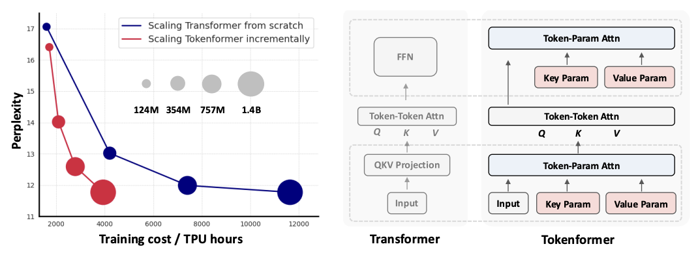
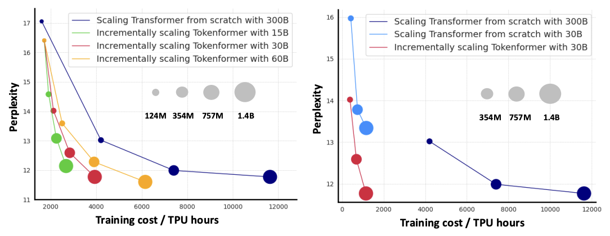
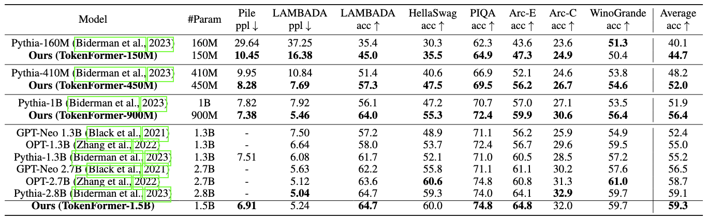

# TokenFormer: a fully attention-based neural network with tokenized model parameters. Maximizing the flexibility of Transformer by Tokenizing Anything.
<h5 align="center">

[](https://arxiv.org/abs/2410.23168)
[](https://haiyang-w.github.io/tokenformer.github.io/)
[](https://huggingface.co/Haiyang-W)
[](https://hits.seeyoufarm.com)
</h5>

This repo is the official implementation of our paper: [TokenFormer: Rethinking Transformer Scaling with Tokenized Model Parameters](https://arxiv.org/abs/2410.23168) as well as the follow-ups. Our TokenFormer is a natively scalable architecture that leverages the attention mechanism not only for computations among input tokens but also for interactions between tokens and model parameters, thereby enhancing architectural flexibility. We have made every effort to ensure that the codebase is clean, concise, easily readable, state-of-the-art, and relies only on minimal dependencies.

> TokenFormer: Rethinking Transformer Scaling with Tokenized Model Parameters
>
> [Haiyang Wang](https://haiyang-w.github.io/), [Yue Fan](https://yue-fan.github.io/), [Muhammad Ferjad Naeem](https://ferjad.github.io/), [Yongqin Xian](https://xianyongqin.github.io/), [Jan Eric Lenssen](https://janericlenssen.github.io/), [Liwei Wang](http://www.liweiwang-pku.com/), [Federico Tombari](https://federicotombari.github.io/), [Bernt Schiele](https://www.mpi-inf.mpg.de/departments/computer-vision-and-machine-learning/people/bernt-schiele)
> - Primary contact: Haiyang Wang (haiwang@mpi-inf.mpg.de), Bernt Schiele (schiele@mpi-inf.mpg.de)

<div align="center">
  
</div>

## 📣 News
- [24-11-02] Please feel free to email me if I've missed any relevant papers. I will do my best to include all related papers in future versions.
- [24-10-31] 🚀 Inference code is released.
- [24-10-31] 👀 TokenFormer is released on [arXiv](https://arxiv.org/abs/2410.23168).

## 🔥 Some Thoughts
- We aim to offer a new perspective to models, applicable to any computation graph in the future. In theory, by using **data tokens**, **parameter tokens**, and **memory tokens**, and **through dot-product interactions**, it's possible to flexibly construct any network. There are many design possibilities here. For example, introducing memory tokens can build RNN-like networks similar to [Mamba](https://arxiv.org/abs/2312.00752). Merging parameter tokens with memory tokens creates something akin to a [TTT network](https://arxiv.org/abs/2407.04620). Parameter tokens can also attend to input data in reverse, making the network parameters dynamically data-dependent, updating layer by layer.
## Overview
- [💫 What we want to do](https://github.com/Haiyang-W/TokenFormer#what-we-want-to-do)
- [🚀 Main Results](https://github.com/Haiyang-W/TokenFormer#main-results)
- [📘 Model Zoo](https://github.com/Haiyang-W/TokenFormer#model-zoo)
- [🛠️ Quick Start](https://github.com/Haiyang-W/TokenFormer#quick-start)
- [👀 Todo](https://github.com/Haiyang-W/TokenFormer#todo)
- [📘 Citation](https://github.com/Haiyang-W/TokenFormer#citation)

## 💫 What want to do?
We introduce Tokenformer, a <font color="red">**fully attention-based**</font> architecture that unifies the computations of token-token and token-parameter interactions by entirely employing the attention mechanism,  <font color="red">**maximizes the flexibility of neural network**</font>. The advantage makes it can handle a variable number of parameters, inherently enhances the model's scalability, facilitating progressively efficient scaling.

<font color="red">**We not only tokenizes data but also model parameters, replacing the model concept with interaction flows between data and parameter tokens, further advancing the network architecture towards unification.**</font>

Hope that this architecture can offer greater flexibility than traditional Transformers, will further contribute to the development of *foundation models*, *sparse inference (MoE)*, *parameter efficient tuning*, *device-cloud collaboration*, *vision-language*,  *model interpretability*, and so on.

```
# Pattention Implementations with given inputs

query, key, value = inputs, key_param_tokens, value_param_tokens

attn_weight = query @ key.transpose(-2, -1) * scale_factor

attn_weight *= attn_masks
# modified softmax, softmax is equal to exp + L1 norm
attn_weight = nonlinear_norm_func(attn_weight, self.norm_activation_type, dim=-1)

output = attn_weight @ value
```

## 🚀 Main results
### Incremental model scaling
<div align="center">
  
</div>

Traditionally, large transformer architectures are trained from scratch without reusing previous smaller-scale models. In this paper, we propose a novel fully attention-based architecture that allows scaling model incrementally, thus greatly reducing the overall cost of training large transformer architectures.

### Language modeling on Pile dataset with zero-shot evaluation

(**Zero-shot Evaluations.**) The best performance for each model size is highlighted in bold. Our comparisons are made with publicly available transformer-based LMs with various tokenizers. Following Pythia, our model is trained for up to 300B tokens on pile dataset.

<div align="center">
  
</div>


### Visual modeling on ImageNet-1k classification

(**Image Classification.**) Comparison of standard vision transformer on ImageNet-1K.

<div align="center">
  
</div>


## 📘 Model Zoo
### Language Modeling Benchmark (Pile)

Pretrained models are uploaded to [huggingface](https://huggingface.co/Haiyang-W) ``TokenFormer-150M``, ``TokenFormer-450M``, ``TokenFormer-900M`` and ``TokenFormer-1-5B``, trained on 300B tokens on the Pile.

These models were trained on the [Pile](https://huggingface.co/datasets/EleutherAI/pile), and follow the standard model dimensions of Transformer, and evaluated on standard zero-shot benchmark described by mamba:
|  Model  |Params| Layers | Model dim. |ckpt|config|log|
|---------|---------|---------|--------|--------|---------|---------|
|  TokenFormer-150M | 150M | 12 | 768  |[ckpt](https://huggingface.co/Haiyang-W/TokenFormer-150M/tree/main)| [config](https://github.com/Haiyang-W/TokenFormer/blob/main/configs/tokenformer/150M_eval.yml) |[log](https://huggingface.co/Haiyang-W/TokenFormer-150M/blob/main/Pile_training_log.txt)|
|  TokenFormer-450M | 450M | 24 | 1024 |[ckpt](https://huggingface.co/Haiyang-W/TokenFormer-450M/tree/main)| [config](https://github.com/Haiyang-W/TokenFormer/blob/main/configs/tokenformer/450M_eval.yml) |[log](https://huggingface.co/Haiyang-W/TokenFormer-450M/blob/main/Pile_training_log.txt)|
|  TokenFormer-900M| 900M| 32 | 1280 |[ckpt](https://huggingface.co/Haiyang-W/TokenFormer-900M/tree/main)| [config](https://github.com/Haiyang-W/TokenFormer/blob/main/configs/tokenformer/900M_eval.yml) |[log](https://huggingface.co/Haiyang-W/TokenFormer-900M/blob/main/Pile_training_log.txt)|
|  TokenFormer-1-5B| 1-5B| 40 | 1536 |[ckpt](https://huggingface.co/Haiyang-W/TokenFormer-1-5B/tree/main)| [config](https://github.com/Haiyang-W/TokenFormer/blob/main/configs/tokenformer/1-5B_eval.yml) |[log](https://huggingface.co/Haiyang-W/TokenFormer-1-5B/blob/main/Pile_training_log.txt)|

Note: these are base models trained only for 300B tokens, without any form of downstream modification (instruction tuning, etc.). Performance is expected to be comparable or better than other architectures trained on similar data, but not to match larger or fine-tuned models.

### Visual Modeling Benchmark (DataComp-1B on CLIP approach)
Will be released later.

## 🛠️ Quick Start
### Installation
First make sure you are in an environment with Python 3.8 with an appropriate version of PyTorch 1.8 or later installed. **Note:** our TokenFormer is based on the [GPT-NeoX](https://github.com/EleutherAI/gpt-neox), some of the libraries that GPT-NeoX depends on have not been updated to be compatible with Python 3.10+. Python 3.9 appears to work, but this codebase has been developed and tested for Python 3.8.

To install the remaining basic dependencies, run:
```
conda create -n TokenFormer python=3.8

git clone https://github.com/Haiyang-W/TokenFormer.git

pip install torch==2.2.1 torchvision==0.17.1 torchaudio==2.2.1 --index-url https://download.pytorch.org/whl/cu121

# raven module load gcc/10

pip install -r requirements/requirements.txt
pip install -r requirements/requirements-flashattention.txt # need gcc > 9
pip install -r requirements/requirements-wandb.txt # optional, if logging using WandB
pip install -r requirements/requirements-tensorboard.txt # optional, if logging via tensorboard
pip install -r requirements/requirements-comet.txt # optional, if logging via Comet

# install apex
pip install -r requirements/requirements-apex-pip.txt # pip > 23.1
git clone https://github.com/NVIDIA/apex
cd apex
pip install -v --disable-pip-version-check --no-cache-dir --no-build-isolation --config-settings "--build-option=--cpp_ext" --config-settings "--build-option=--cuda_ext" ./
```
from the repository root.

### Evaluations
To run zero-shot evaluations of models (corresponding to Table 1 of the paper), we use the [lm-evaluation-harness](https://github.com/EleutherAI/lm-evaluation-harness) library.

First you should download the pre-trained weights from [huggingface](https://huggingface.co/Haiyang-W) to your local directory. For example, the relative path is ``./TokenFormer-150M/pytorch_model.bin`` from the repository root. 
```
# single-gpu evaluation (currently only tested on single-gpu.)

cd ./TokenFormer
python ./deepy.py eval.py -d configs tokenformer/150M_eval.yml --eval_tasks lambada_openai hellaswag piqa arc_challenge arc_easy winogrande
```

### Preconfigured Datasets for Training
Several preconfigured datasets are available, including most components from [openwebtext](https://huggingface.co/datasets/segyges/OpenWebText2) and [Pile](https://huggingface.co/datasets/monology/pile-uncopyrighted). 

e.g. to download and tokenize the openwebtext2 dataset with GPT-NeoX 20B Tokenizer. You can try this small dataset first.
```
python prepare_data.py -d ./data -t HFTokenizer --vocab-file tokenizer.json openwebtext2
```
The preprocessed data will be located in `./data/openwebtext2`.

For the Pile 300B (unofficial and uncopyied version):
```
python prepare_data.py -d ./data -t HFTokenizer --vocab-file tokenizer.json pile
```
The preprocessed data will be located in `./data/pile`.

The tokenized data will be saved out to two files: `[data-dir]/[dataset-name]/[dataset-name]_text_document.bin` and `[data-dir]/[dataset-name]/[dataset-name]_text_document.idx`. You will need to add the prefix that both these files share to your training configuration file under the data-path field. E.G:
```
"data-path": "./data/pile/pile_0.87_deduped_text_document",
```

If you just want to get it running easily, you can try `enwik8`.

### Training
#### Single Node Launching
Note that this is for single node. Applicable if you can already SSH into an 8-GPU machine and run programs directly.
```
CUDA_VISIBLE_DEVICES=0,1,2,3,4,5,6,7 python deepy.py train.py configs/tokenformer/150M_train_pile.yml
```
#### Multiple Nodes Launching
Please refer [multi-node-launching](https://github.com/EleutherAI/gpt-neox#multi-node-launching). I use slurm and give some guidance as follows.

First, modify your training config
```
{
  "launcher": "slurm",
  "deepspeed_slurm": true,
}
```
Then I provide my slurm script with 16 GPUs as an example.
```
#!/bin/bash
#SBATCH --job-name="150M_16gpus"
#SBATCH --constraint="gpu"
#SBATCH --nodes=2
#SBATCH --ntasks-per-node=8
#SBATCH --gres=gpu:8
#SBATCH --cpus-per-task=4   #   using 4 cores each. 
#SBATCH --time=24:00:00
#SBATCH -o /tmp/150M_%A_%a.out

conda activate TokenFormer

# Some potentially useful distributed environment variables
export HOSTNAMES=`scontrol show hostnames "$SLURM_JOB_NODELIST"`
export MASTER_ADDR=$(scontrol show hostnames "$SLURM_JOB_NODELIST" | head -n 1)
export MASTER_PORT=12856
export COUNT_NODE=`scontrol show hostnames "$SLURM_JOB_NODELIST" | wc -l`

# Your hostfile creation script from above
bash ./write_hostfile.sh
# Tell DeepSpeed where to find our generated hostfile via DLTS_HOSTFILE, you can customize any path. 
export DLTS_HOSTFILE=/tmp/hosts_$SLURM_JOBID

python3 deepy.py train.py ./configs/tokenformer/150M_train_pile.yml

```
All paths here can be customized; you can replace `/tmp` in the above script and `write_hostfile.sh` with any path you want. Then run the scripts
```
sbatch scripts.sh
```

#### Zero-shot evaluation after your training
Go to your checkpoint directory, E.G., 150M
```
cd ./work_dirs/150M_TokenFormer_Pile/checkpoints
python zero_to_fp32.py . pytorch_model.bin
```
Then use that path to replace the **[eval_ckpt](https://github.com/Haiyang-W/TokenFormer/blob/79a02d8a2f847e8bbc627f7cb1632a2f24f3f826/configs/tokenformer/150M_eval.yml#L98)** in `150M_eval.yml`.
```
cd ./TokenFormer
python ./deepy.py eval.py -d configs tokenformer/150M_eval.yml --eval_tasks lambada_openai hellaswag piqa arc_challenge arc_easy winogrande
```

`NOTE:` I’ve only run the training code for the first 1000 iterations to check the loss, and it looks fine, so I’m releasing it for everyone to use for now. I can’t guarantee there are no issues. If you’d prefer to wait, I can do a final check, but it might take some time.

## 👀 TODO

- [x] Release the [arXiv](https://arxiv.org/abs/2410.23168) version.
- [x] Release inference code and model weights of LLM.
- [x] Release training code of LLM.
- [ ] Release incremental scaling training code of LLM.
- [ ] Release training code of Image Classification.
- [ ] Release model weights of CLIP trained on DataComp-1B.
- [ ] Release some initial results of Vision Language Modeling on LLaVA benchmark.

## 📘 Citation
Please consider citing our work as follows if it is helpful.
```
@article{wang2024tokenformer,
  title={TokenFormer: Rethinking Transformer Scaling with Tokenized Model Parameters},
  author={Wang, Haiyang and Fan, Yue and Naeem, Muhammad Ferjad and Xian, Yongqin and Lenssen, Jan Eric and Wang, Liwei and Tombari, Federico and Schiele, Bernt},
  journal={arXiv preprint arXiv:2410.23168},
  year={2024}
}
```
